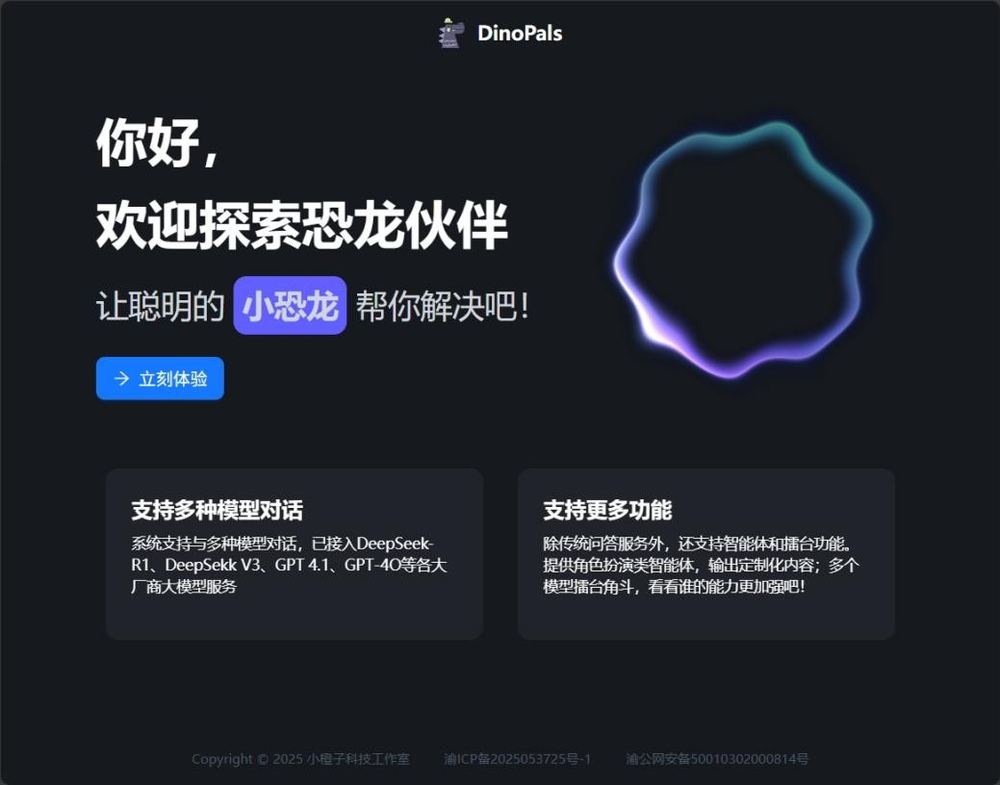
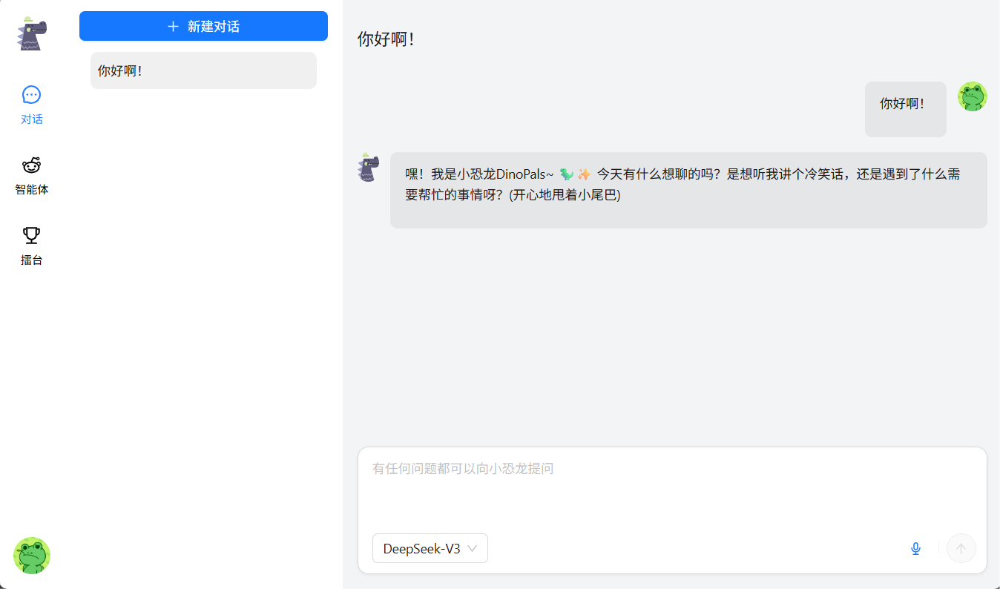
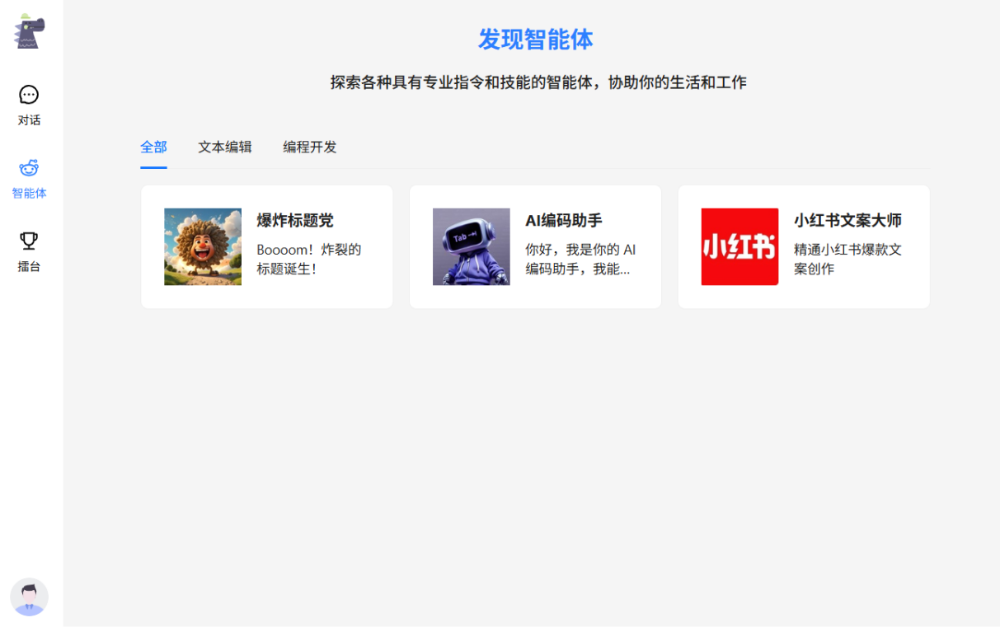
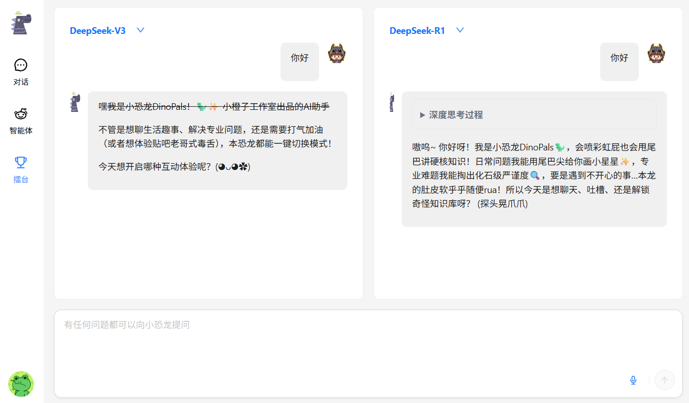
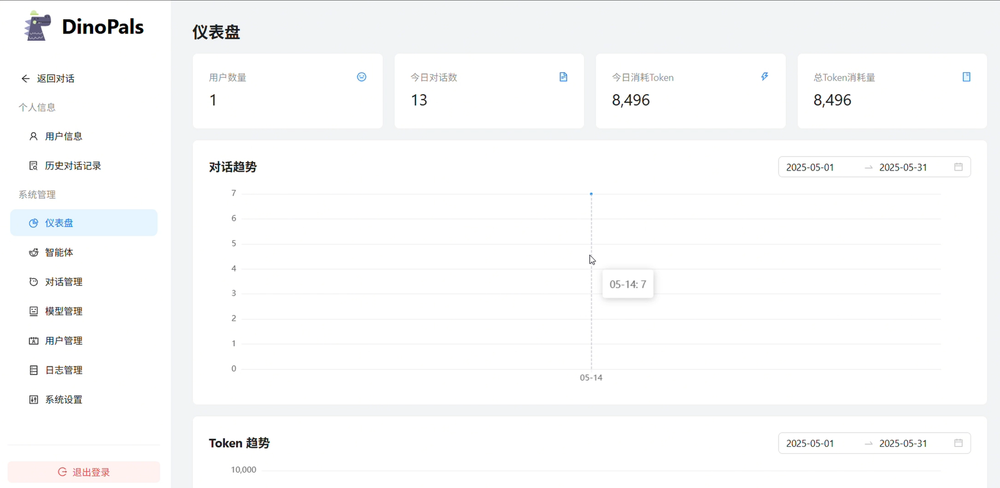

# 恐龙伙伴 AI 聊天平台


一个功能丰富 AI 聊天平台，支持多模型对话、智能体系统和 AI 模型对战功能。

## 📸 界面展示








## 🌟 功能特性

### 核心功能
- **多模型对话**: 支持 DeepSeek-R1、DeepSeek V3、GPT-4.1、GPT-4O 等主流大模型
- **智能体系统**: 提供角色扮演类智能体，输出定制化内容
- **AI 擂台对战**: 多个模型同台竞技，比较不同模型的能力
- **聊天记录管理**: 完整的对话历史记录和管理功能

### 管理功能
- **用户管理**: 用户注册、登录、权限管理
- **智能体管理**: 智能体创建、编辑、分类管理
- **模型管理**: AI 模型配置和管理
- **系统设置**: 系统配置、日志管理、数据监控

## 🏗️ 技术架构

### 后端技术栈
- **框架**: Go + Gin Web 框架
- **数据库**: MySQL + GORM ORM
- **缓存**: Redis
- **日志**: Zap 日志系统
- **认证**: JWT Token 认证
- **API 集成**: OpenAI API、各大模型厂商 API

### 前端技术栈
- **框架**: React 19 + TypeScript
- **构建工具**: Vite
- **UI 组件**: Ant Design + Tailwind CSS
- **状态管理**: Redux Toolkit
- **路由**: React Router v7
- **Markdown 渲染**: React Markdown + 语法高亮
- **数学公式**: KaTeX
- **图表**: ECharts

## 📦 项目结构

```
AiCode/
├── server/                 # Go 后端服务
│   ├── api/               # API 接口层
│   ├── controller/        # 控制器层
│   ├── model/            # 数据模型层
│   ├── service/          # 服务层
│   ├── middleware/       # 中间件
│   ├── router/           # 路由配置
│   ├── global/           # 全局配置
│   ├── initialization/   # 初始化模块
│   └── utils/            # 工具函数
├── web/                   # React 前端应用
│   ├── src/
│   │   ├── components/   # 可复用组件
│   │   ├── views/        # 页面组件
│   │   ├── apis/         # API 接口
│   │   ├── stores/       # 状态管理
│   │   ├── hooks/        # 自定义 Hooks
│   │   ├── types/        # TypeScript 类型定义
│   │   └── utils/        # 工具函数
│   └── public/           # 静态资源
└── deploy/               # 部署配置
```

## 🚀 快速开始

### 环境准备
- Go 1.24.2+
- Node.js 18+
- MySQL 8.0+
- Redis 6.0+

### 后端启动

1. 进入后端目录
```bash
cd server
```

2. 安装依赖
```bash
go mod tidy
```

3. 配置数据库和 Redis 连接（修改配置文件）

4. 启动服务
```bash
go run main.go
```

### 前端启动

1. 进入前端目录
```bash
cd web
```

2. 安装依赖
```bash
yarn install
```

3. 启动开发服务器
```bash
yarn dev
```

4. 构建生产版本
```bash
yarn build
```

## 🔧 配置说明

### 后端配置
- 数据库连接配置
- Redis 连接配置
- AI 模型 API 密钥配置
- 系统端口和域名配置

### 前端配置
- API 接口地址配置
- 系统主题和样式配置

## 📝 API 文档

### 认证相关
- `POST /auth/login` - 用户登录
- `POST /auth/register` - 用户注册
- `POST /auth/logout` - 用户登出

### 聊天相关
- `GET /chat/agents/category` - 获取智能体分类
- `GET /chat/agents/list` - 获取智能体列表
- `GET /chat/agents/:id` - 获取指定智能体信息
- `POST /chat/agent` - 上报智能体对话记录

### 管理相关
- `GET /admin/dashboard` - 管理后台仪表板
- `GET /admin/users` - 用户管理
- `GET /admin/agents` - 智能体管理
- `GET /admin/models` - 模型管理

## 🛡️ 安全特性

- JWT Token 认证机制
- 请求参数验证
- SQL 注入防护
- XSS 攻击防护
- 接口访问频率限制

## 📈 监控与日志

- 完整的访问日志记录
- 错误日志收集和分析
- 系统性能监控
- 用户行为统计